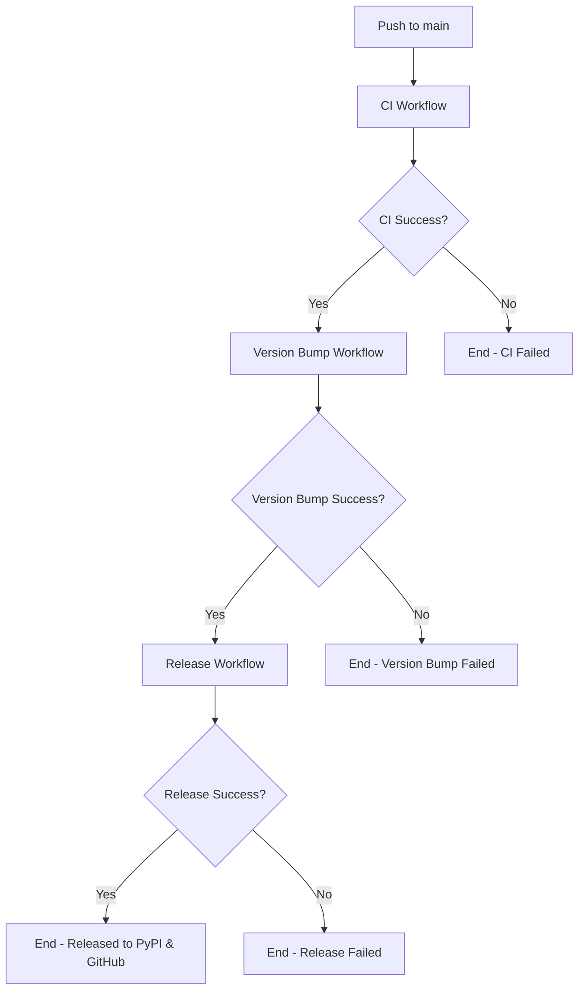

# Workflow Execution Flow

## Workflow Dependencies

1. **CI Workflow** (`ci.yml`)
   - Triggered: Push/PR to main
   - Runs: Tests, linting
   - Next: Version Bump (if success)

2. **Version Bump Workflow** (`version-bump.yml`)
   - Triggered: CI workflow completion (success)
   - Runs: Semantic version increment, commit new version
   - Next: Release (if success)

3. **Release Workflow** (`release.yml`)
   - Triggered: Version Bump workflow completion (success)
   - Runs: Build package, create GitHub release, publish to PyPI
   - Next: End

## Skip Conditions

- Version Bump skips if commit message contains:
  - `bump version`
  - `[skip-version]`

- Release skips if:
  - Git tag already exists for current version
  - Previous workflows failed

## Commit Message Conventions

- `feat:` or `minor` → Minor version bump (0.1.0 → 0.2.0)
- `BREAKING CHANGE` or `major` → Major version bump (0.1.0 → 1.0.0)
- Other commits → Patch version bump (0.1.0 → 0.1.1)